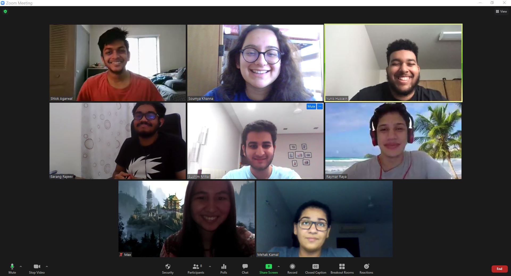
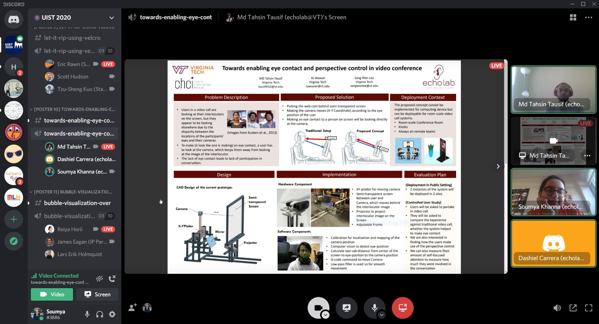
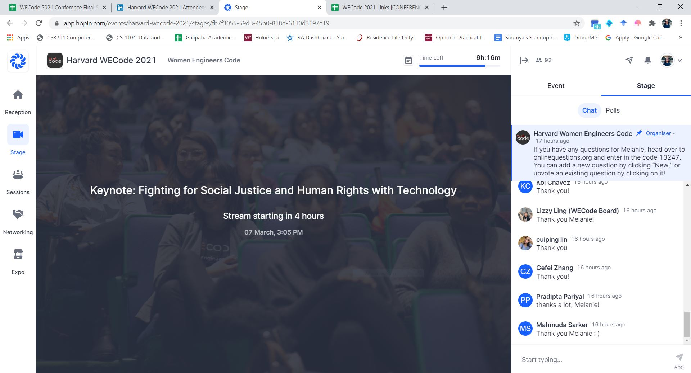

# About Me

My name is Soumya Khanna and I'm a third-year Computer Science student at Virginia Tech graduating in May 2021. My interests in CS are Software Engineering, Human-Computer Interaction, and Virtual Reality. Over the past summer, I learned mobile application development using ReactNative while participating in a hackathon. I'm currently working on two research projects in echolab under Dr. Sang Won Lee. I'm actively involved with VT clubs and organizations such as Developer Student Club, Student Engineers' Council, Association of Women in Computing, Engineers' Forum, and CEED International Team. 

# Involvement

## Undergraduate Research

 **Narcissistic Eyes**
 
 **VR Viewfinder**
 
 **360-degree video**
 

## Clubs & Organizations 

 **Developer Student Clubs, Virginia Tech**
 
  - Increased club membership by 100+ students across 2 colleges
  - Organized 10+ workshops & speaker sessions with 70+ attendees across North America
  - Managed & led a team of 8+ core team members to coordinate events, members and projects

 
 **Student Engineers' Council (SEC)**
 
  - Redesigned the organization website to make it more user-friendly
  - Updated & customized the LEC & Engineering Expo websites before the events
  - Utilized ASP.NET MVC framework to develop the sites

Relevant links:
[SEC](https://www.sec.vt.edu/) | [Expo](https://expo.sec.vt.edu/) 

 
 **Association of Women in Computing (AWC)**
 
  - 
  -
  -

 **Engineers' Forum**
 
  - 
  - 
  - 

 **International Student Support Team**
 
  - 
  - 
  - 

## Conferences

 **Grace Hopper Celebration 2020**
 
 **ACM Symposium on User Interface Science and Technology 2020**
 
 

 
 
 **Harvard WECode 2021**
 
 

 
 

# Projects

# Resume

Click [here](https://github.com/soumyakhanna/soumyakhanna.github.io/blob/master/Soumya%20Khanna%20Resume.pdf) to view my resume.

# Contact Me

 Connect with me on [LinkedIn](https://www.linkedin.com/in/soumyakhanna/)
 Contact me [Email](mailto:soumyak@vt.edu)
