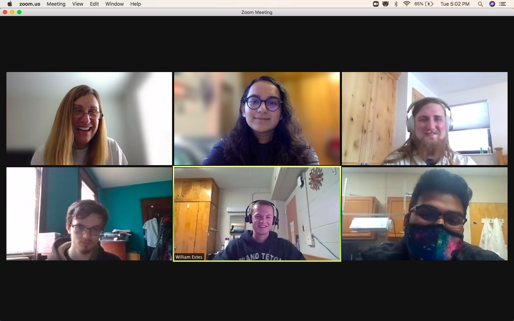
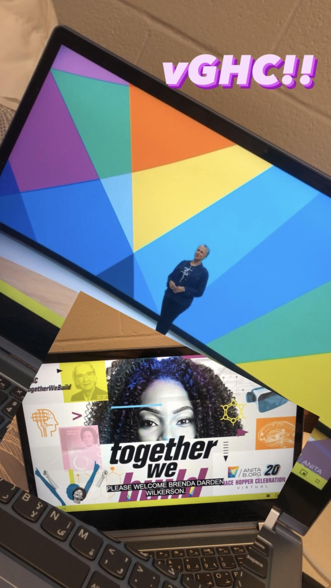

# Welcome to Soumya's website :)

## About Me

My name is Soumya Khanna and I'm a third-year Computer Science student at Virginia Tech graduating in May 2021. My interests in CS are Software Engineering, Human-Computer Interaction, and Virtual Reality. Over the past summer, I learned mobile application development using ReactNative while participating in a hackathon. I'm currently working on two research projects in echolab under Dr. Sang Won Lee. I'm actively involved with VT clubs and organizations such as Developer Student Club, Student Engineers' Council, Association of Women in Computing, Engineers' Forum, and CEED International Team. 

## Undergraduate Involvement

### [Research Projects](https://echolab.cs.vt.edu/)

**Narcissistic Eyes**
 
Project description: Study self-monitoring in video conferences based on different social aspects by tracking eye movements while conducting a mock job    interview.
  - Led 18+ user studies for the project
 
**VR Viewfinder**
 
Project description: Provide an interactive third-person perspective while watching live VR art performances. 
  - Improved the Unity environment by adding a color picker and fixing user issues
 
**360-degree video**
 
Project description: Evaluate the performance of 360-degree videos based on the different orientations to provide a more natural experience to users as well as understanding the future use of 360-degree videos.
  - Implemented a survey for 360-degree video creators

### Clubs & Organizations 

**[Developer Student Clubs, Virginia Tech](https://sites.google.com/vt.edu/dscvt/)**
 
  - Increased club membership by 100+ students across 2 colleges
  - Organized 10+ workshops & speaker sessions with 70+ attendees across North America
  - Managed & led a team of 8+ core team members to coordinate events, members and projects

Relevant links:
[DSC](https://sites.google.com/vt.edu/dscvt/) | [YouTube](https://www.youtube.com/channel/UCojVJ9mRM8hkmyYOU90hFEQ/featured)

*DSC Core Team Meeting*
 
 **[Student Engineers' Council (SEC)**](https://www.sec.vt.edu/)**
 
  - Redesigned the organization website to make it more user-friendly
  - Updated & customized the LEC & Engineering Expo websites before the events
  - Utilized ASP.NET MVC framework to develop the sites

Relevant links:
[SEC](https://www.sec.vt.edu/) | [Expo](https://expo.sec.vt.edu/) 
 

*Meeting with the Dean of the College of Engineering, Julia Ross*

**[Association of Women in Computing (AWC)](http://www.awc.org.vt.edu/)**
 
  - Headed 3+ outreach events for middle-high school students in the NRV region
  - Partnered with 7+ local schools to raise awareness about STEM 
  - Guided a group of 10+ student volunteers to support the events

Relevant links:
[AWC](http://www.awc.org.vt.edu/)

**[Engineers' Forum](http://www.ef.org.vt.edu/)**
 
  - Streamlined the process for 15+ new club members 
  - Advertised the magazine through 7+ student organizations to increase readership
  - Recruited new officers for the next academic year

Read my articles here:
- [COVID-19 Research within the College of Engineering](https://issuu.com/engineersforum/docs/septefissue2020_v7_web)
- [inspireFly: Making Space Local](https://issuu.com/engineersforum/docs/aprilefissueissuu)
- [Supporting International Students in Galipatia LLC](http://www.ef.org.vt.edu/wp-content/uploads/2020/03/FebEFIssue_WEB5.pdf)
- [Hokie Success at NAVAIR FRC East](http://www.ef.org.vt.edu/wp-content/uploads/2019/08/SeptEFIssueFinal10_nobleed2.pdf)
- [The benefits of the Innovation Campus & Amazon HQ2](http://www.ef.org.vt.edu/wp-content/uploads/2019/05/AprEFIssueFinal-Bleed-min.pdf)

**[International Student Support Team](https://eng.vt.edu/ceed.html)**
 
  - Organized 10+ events throughout the year for 100+ international freshmen within the College of Engineering
  - Built a virtual community for students through monthly newsletters, shared resources and social media  
  - Successfully recruited 30+ international students to the engineering living learning communities Galipatia 

Relevant links:
[ISST](https://www.instagram.com/ceed_intl)

### Conferences

**Grace Hopper Celebration 2020**
 
  - Selected as 1 of 25 CS students to receive a scholarship by the Department of Computer Science

 
*Virtual GHC Keynote Speech*
 
 **ACM Symposium on User Interface Science and Technology 2020**
 
  - Received a scholarship to represent echolab at Virginia Tech 

 
*Workshop paper presented by a fellow researcher*
 
 **Harvard WECode 2021**
 
  - Received a scholarship to attend by the Association of Women in Computing (AWC)

 
*WECode Conference via Hoppin*

## Projects
**[Thrifty](https://github.com/soumyakhanna/Thrifty)**, SummerHacks 2020 hosted by FreeTailHackers
 Project Description:
 Technologies:

 **[RunTime](https://github.com/soumyakhanna/runTime)**, SheHacksVT 2020 hosted by Association of Women in Computing (AWC)
 Project Description:
 Technologies:

 **[ParkMyCar](https://github.com/soumyakhanna/parkMyCar)**, VTHacks 7
 Project Description:
 Technologies:

## Resume
Click [here](https://github.com/soumyakhanna/soumyakhanna.github.io/blob/master/Soumya%20Khanna%20Resume.pdf) to view my resume.

## Contact Me
Connect with me on [LinkedIn](https://www.linkedin.com/in/soumyakhanna/)
 Contact me via [email](mailto:soumyak@vt.edu) | 540-449-5627

## Gallery 
[VSCO](https://vsco.co/soumyakhanna99/gallery) | [Instagram](https://www.instagram.com/soumya__khanna/) | [YouTube](https://www.youtube.com/channel/UCkoSc7KAlIw4I80SUfLtjsg) 
